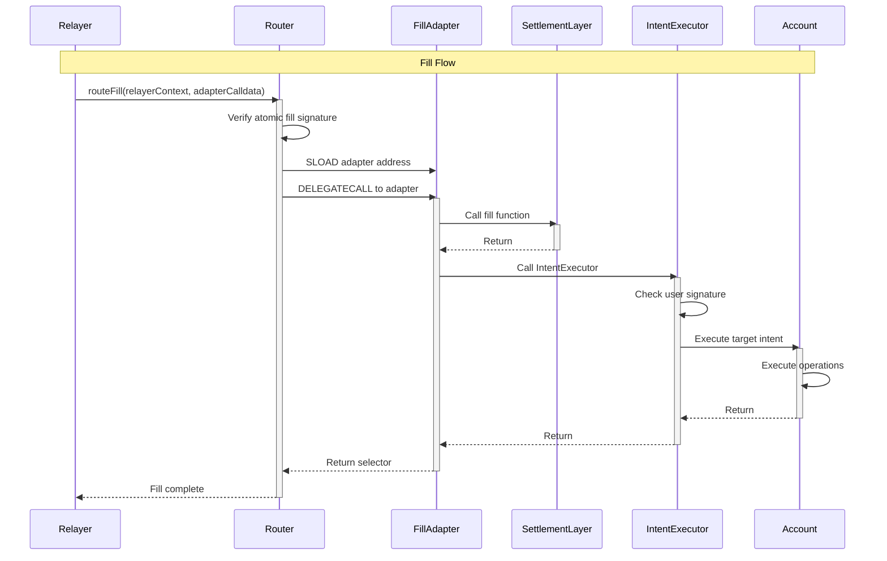
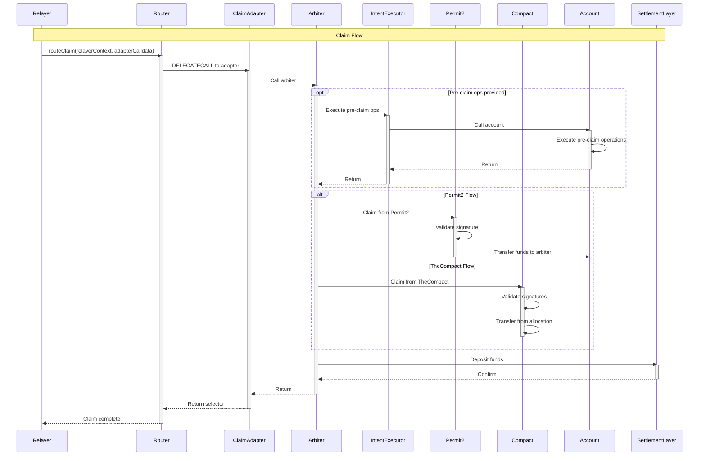

# Architecture Overview

Warp Router implements a modular, delegatecall-based architecture that separates routing logic from protocol-specific settlement implementations. This design enables seamless integration of new protocols while maintaining consistent security guarantees and gas optimizations across all settlement types.

## System Architecture

The architecture consists of three primary layers:


<CardGroup cols={3}>
  <Card title="Router Layer" icon="route">
    Handles operation routing, batching of settlement layers, and enforcement of atomicity
  </Card>
  <Card title="Adapter Layer" icon="puzzle-piece">
    Protocol-specific settlement logic executed via delegatecall
  </Card>
  <Card title="Arbiter Layer" icon="gavel">
    Validates and unlocks user resources for settlement
  </Card>
</CardGroup>

## Layer 1: Router

The Router system serves as the central coordination hub for all settlement operations. It combines execution logic (RouterLogic) with adapter lifecycle management (RouterManager) to provide a complete routing solution.

### Core Components

<AccordionGroup>
  <Accordion title="RouterLogic - Execution Engine">
    The RouterLogic contract orchestrates all settlement operations:
    
    ```solidity src/router/core/RouterLogic.sol
    contract RouterLogic is IRouter, RouterManager, DirectRoutes, ReentrancyGuardTransient {
        /**
         * @notice Initializes the RouterLogic contract with essential security
         *         and management addresses.
         * @param atomicFillSigner The address authorized to sign atomic fill
         *        batch operations.
         * @param adder The address granted ADAPTER_ADDER_ROLE for registering
         *        new protocol adapters.
         * @param remover The address granted ADAPTER_REMOVER_ROLE for disabling
         *        problematic adapters.
         */
        constructor(
            address atomicFillSigner,
            address adder,
            address remover
        ) RouterManager(adder, remover) {
            $atomicFillSigner = atomicFillSigner;
        }
    }
    ```
    
    **Key Responsibilities:**
    - Atomic intent processing across multiple operations
    - Gas optimization through adapter caching
    - Signature validation for all fill operations
    - Reentrancy protection via transient storage
  </Accordion>
  
  <Accordion title="RouterManager - Lifecycle Management">
    The RouterManager handles adapter registration, versioning, and lifecycle:
    
    **Features:**
    - **Semantic Versioning**: Enforces version compatibility for safe upgrades
    - **Hotfix Support**: Allows patch-only upgrades for critical fixes
    - **Role-Based Access**: Separate roles for adding (ADD_ROLE) and removing (RM_ROLE) adapters
    - **Emergency Pause**: Can pause all fill operations by setting signer to address(0)
    
    **Adding New Adapters:**
    ```solidity
    // Install a new adapter (requires ADD_ROLE)
    routerManager.installFillAdapter(
        version,    // Semantic version (2 bytes)
        selector,   // Function selector
        adapter,    // Adapter contract address
        tag        // Optional metadata (12 bytes)
    );
    ```
  </Accordion>
  
  <Accordion title="DirectRoutes - Special Operations">
    Built-in operations that bypass adapter lookup for common tasks:
    
    - `singleCall`: Direct contract interaction
    - `multiCall`: Batched contract interactions
    - Fee collection operations
    
    **Gas Savings:** Special selectors save 2,600+ gas by avoiding both storage reads and delegatecalls.
  </Accordion>
</AccordionGroup>

### Operation Types

<Tabs>
  <Tab title="Fill Operations">
    Fill operations are settlement operations that fulfill user orders by transferring assets and executing target operations.
    
    **Standard Fill Route:**
    ```solidity
    function routeFill(
        bytes calldata relayerContext,
        bytes calldata adapterCalldata
    ) external payable nonReentrant;
    ```
    
    **Optimized Batch Fill:**
    ```solidity src/router/core/RouterLogic.sol
    /**
     * @notice Gas-optimized version of routeFill with enhanced batching
     *         and caching mechanisms.
     * @dev Implements several optimizations:
     *      1. Encoded calldata format reduces decoding costs
     *      2. Adapter caching saves ~2100 gas per cache hit
     *      3. Special selector optimization bypasses adapter lookup
     *      4. Inline assembly decoding operates directly on calldata
     *      5. Solver context management for efficient consumption tracking
     */
    function optimized_routeFill921336808(
        bytes[] calldata relayerContexts,
        bytes calldata encodedAdapterCalldatas,
        bytes calldata atomicFillSignature
    ) public payable virtual nonReentrant {
        // Compute hash and verify atomic signature
        bytes32 hash = encodedAdapterCalldatas.hashCalldata();
        require(_isAtomic(hash, atomicFillSignature), InvalidAtomicity());
        
        // Execute batch with caching and optimizations
        // ...
    }
    ```
    
    <Info>Fill operations require atomic signatures from the designated atomic signer.</Info>
  </Tab>
  
  <Tab title="Claim Operations">
    Claim operations unlock user resources from protocols like TheCompact or Permit2.
    
    **Single Claim:**
    ```solidity
    function routeClaim(
        bytes calldata relayerContext,
        bytes calldata adapterCalldata
    ) external payable nonReentrant;
    ```
    
    **Batch Claims:**
    ```solidity
    function routeClaim(
        bytes[] calldata relayerContexts,
        bytes[] calldata adapterCalldatas
    ) external payable nonReentrant;
    ```
    
    <Note>Claim operations don't require atomic signatures as they rely on protocol-level authorization.</Note>
  </Tab>
</Tabs>

### Gas Optimization Features

The Router implements advanced optimization techniques:

<Steps>
  <Step title="Adapter Caching">
    Consecutive operations with the same selector reuse cached adapter addresses:
    
    ```solidity
    // Cache the adapter address on first use
    address adapter = selector.resolveAdapter(version);
    cachedAdapter = adapter;
    cachedSelector = selector;
    
    // Reuse on subsequent calls with same selector
    if (selector == cachedSelector) {
        adapter = cachedAdapter;  // Saves ~2100 gas
    }
    ```
    
    **Savings:** Approximately 2,100 gas per cache hit (avoids cold SLOAD)
  </Step>
  
  <Step title="Special Selector Bypass">
    Built-in operations skip adapter lookup entirely:
    
    ```solidity
    // Special selectors handled directly
    if (selector == SINGLE_CALL_SELECTOR) {
        _handleSingleCall(calldata);
        return;  // No adapter lookup or delegatecall
    }
    ```
    
    **Savings:** 2,600+ gas (avoids SLOAD + DELEGATECALL overhead)
  </Step>
  
  <Step title="Optimized Encoding">
    The optimized route accepts pre-encoded calldata arrays:
    
    ```solidity
    // Standard: decodes array from memory
    bytes[] calldata calldatas;  // ABI decoding overhead
    
    // Optimized: operates on raw encoded bytes
    bytes calldata encoded;  // Direct calldata access
    ```
    
    **Savings:** 200-500 gas per element in the array
  </Step>
  
  <Step title="Context Indexing">
    Efficient tracking of which operations consume solver contexts:
    
    ```solidity
    // Only increment context index for non-special operations
    if (!isSpecialSelector(selector)) {
        relayerContext = relayerContexts[contextIndex++];
    }
    ```
    
    **Savings:** Reduces unnecessary array access and bounds checking
  </Step>
</Steps>

### Security Model

<CardGroup cols={2}>
  <Card title="Atomic Signatures" icon="signature">
    All fill operations require cryptographic signatures from the atomic signer, preventing unauthorized execution.
  </Card>
  <Card title="Reentrancy Protection" icon="shield">
    ReentrancyGuardTransient protects all external functions using efficient transient storage (EIP-1153).
  </Card>
  <Card title="Role-Based Access" icon="user-shield">
    Separate roles for adapter management prevent unauthorized protocol modifications.
  </Card>
  <Card title="Batch Integrity" icon="atom">
    All operations in a batch must succeed or the entire batch reverts, ensuring atomicity.
  </Card>
</CardGroup>

## Layer 2: Adapters

Adapters are protocol-specific contracts that handle the actual settlement logic for different protocols and chains. They are always executed via delegatecall from the Router, inheriting its storage context and permissions.

### Adapter Architecture

```solidity src/base/adapter/AdapterBase.sol
/**
 * @title AdapterBase
 * @notice Abstract base contract for settlement layer specific adapters
 * @dev CRITICAL SECURITY NOTICE:
 *      - Adapters are ALWAYS executed via delegatecall from the Router contract
 *      - The Router's storage and balance are accessible during adapter execution
 *      - DO NOT implement direct calls to untrusted contracts
 *      - All external calls to untrusted contracts could be detrimental to Router security
 */
abstract contract AdapterBase is IAdapter, SemVer, IIndexedEvents {
    /// @notice The Router contract address that this adapter is designed to work with
    address public immutable _ROUTER;
    
    /// @notice The Arbiter contract address responsible for validating settlements
    address public immutable ARBITER;
    
    constructor(address router, address arbiter) {
        _ROUTER = router;
        ARBITER = arbiter == address(0) ? address(this) : arbiter;
    }
    
    /**
     * @notice Ensures function is only called via delegatecall from the Router
     * @dev When delegatecalled from Router, address(this) equals _ROUTER
     */
    modifier onlyViaRouter() {
        require(address(this) == _ROUTER, OnlyDelegateCall());
        _;
    }
}
```

### Implementation Requirements

<Warning>All adapter functions implementing fill or claim logic must follow strict requirements:</Warning>

<Steps>
  <Step title="Return Function Selector">
    All external functions must return their own function selector:
    
    ```solidity
    function myFillOperation(...) external returns (bytes4) {
        // Settlement logic here
        return this.myFillOperation.selector;
    }
    ```
    
    This enables the Router to validate successful execution.
  </Step>
  
  <Step title="Implement ERC165">
    All fill/claim functions must be registered in `supportsInterface`:
    
    ```solidity
    function supportsInterface(bytes4 interfaceId) public pure override returns (bool) {
        return interfaceId == this.myFillOperation.selector ||
               interfaceId == this.myClaimOperation.selector ||
               super.supportsInterface(interfaceId);
    }
    ```
  </Step>
  
  <Step title="Use onlyViaRouter Modifier">
    All external functions must use the security modifier:
    
    ```solidity
    function myOperation(...) external onlyViaRouter returns (bytes4) {
        // Only callable via Router delegatecall
    }
    ```
  </Step>
</Steps>

### Solver Context Handling

Adapters extract solver-specific data using the `_loadRelayerContext()` helper:

```solidity src/base/adapter/AdapterBase.sol
/**
 * @notice Extracts relayer-provided context data from the end of the calldata
 * @dev The Router appends relayer context using:
 *      abi.encodePacked(adapterCalldata, relayerContext, uint256(relayerContext.length))
 * 
 *      Resulting format: [original_function_calldata][relayer_context_bytes][context_length_32_bytes]
 */
function _loadRelayerContext() internal pure returns (
    uint256 contextLength,
    bytes calldata relayerContext
) {
    assembly ("memory-safe") {
        let totalSize := calldatasize()
        contextLength := calldataload(sub(totalSize, 0x20))
        relayerContext.offset := sub(totalSize, add(contextLength, 0x20))
        relayerContext.length := contextLength
    }
}
```

**Example Usage:**

```solidity src/arbiters/samechain/SameChainAdapter.sol
function _tokenInRecipient() internal pure returns (address tokenInRecipient) {
    (uint256 relayerContextLength, bytes calldata relayerContext) = _loadRelayerContext();
    require(relayerContextLength == 20, InvalidRelayerContext());
    // Decode the recipient address from the first 20 bytes
    return address(bytes20(relayerContext[:20]));
}
```

### Example Adapter: IntentExecutorAdapter

The IntentExecutorAdapter demonstrates a simple forwarding pattern:

```solidity src/adapters/IntentExecutorAdapter.sol
/**
 * @title IntentExecutorAdapter
 * @notice Gas-optimized adapter for forwarding intent execution calls
 * @dev Uses memory-safe assembly for calldata forwarding to minimize gas overhead,
 *      typically saving 200-500 gas per call compared to high-level Solidity.
 */
contract IntentExecutorAdapter is AdapterBase {
    address internal immutable EXECUTOR;
    
    constructor(address router, address executor) 
        AdapterBase(router, address(0)) 
        SemVer(0, 0) 
    {
        EXECUTOR = executor;
    }
    
    /**
     * @notice Handles compact intent execution by forwarding to the executor
     * @dev Forwards the call using optimized assembly forwarding
     */
    function handleFill_intentExecutor_handleCompactTargetOps(
        bytes calldata executorCalldata
    ) external payable onlyViaRouter returns (bytes4) {
        EXECUTOR.passthrough(COMPACT_INTENT_SELECTOR, executorCalldata);
        return this.handleFill_intentExecutor_handleCompactTargetOps.selector;
    }
    
    function supportsInterface(bytes4 selector) public pure override returns (bool) {
        return selector == this.handleFill_intentExecutor_handleCompactTargetOps.selector ||
               super.supportsInterface(selector);
    }
}
```

## Layer 3: Arbiters

Arbiters are responsible for validating settlements and unlocking funds from user accounts or resource locks. They provide dual protocol support for both TheCompact and Permit2 standards.

### Arbiter Architecture

```solidity src/base/arbiter/ArbiterBase.sol
/**
 * @title ArbiterBase
 * @notice Base arbiter contract that enables unlocking funds from user accounts
 * @dev Serves as a critical component acting as an arbiter that can unlock and
 *      manage funds on behalf of users. Provides dual protocol support for both
 *      TheCompact and Permit2 standards.
 */
contract ArbiterBase is CompactArbiter, Permit2Arbiter, PreClaimExecution, IArbiter {
    /// @dev The Router address that has exclusive access to settlement functions
    address internal immutable ROUTER;
    
    constructor(
        address router,
        address compact,
        address addressBook
    )
        CompactArbiter(compact)
        Permit2Arbiter(address(Constants.PERMIT2))
        PreClaimExecution(addressBook)
    {
        ROUTER = router;
    }
    
    /**
     * @notice Restricts function access to only the authorized Router contract
     * @dev Critical security boundary preventing unauthorized access to user funds
     */
    modifier onlyRouter() {
        require(msg.sender == ROUTER, OnlyRouter());
        _;
    }
}
```

### Key Responsibilities

<AccordionGroup>
  <Accordion title="Execute Pre-Claim Operations">
    Arbiters execute optional operations before settlement:
    
    ```solidity src/base/arbiter/ArbiterBase.sol
    function _compactPreClaimOps(
        Types.Order calldata order,
        Types.Signatures calldata sigs,
        bytes32[] calldata otherElements,
        uint256 elementOffset,
        uint256 notarizedChainId
    ) internal returns (bytes32 mandateHash) {
        // Compute EIP-712 hashes for order components
        bytes32 targetAttributesHash = order.hashTargetAttributes();
        bytes32 destOpsHash = order.targetOps.hashOps();
        
        // Determine if pre-claim operations need execution
        (SmartExecutionLib.Type opsType, bytes32 preClaimOpsHash) = 
            order.preClaimOps.decodeAll();
        
        // Execute pre-claim operations if they exist
        if (preClaimOpsHash != Constants.NO_OPS) {
            if (opsType == SmartExecutionLib.Type.ERC7579) {
                _handlePreClaimOpsCompactERC7579({...});
            } else if (opsType == SmartExecutionLib.Type.MultiCall) {
                _handlePreClaimOpsMulticall({...});
            } else if (opsType == SmartExecutionLib.Type.Calldata) {
                _handlePreClaimOpsCallData({...});
            }
        }
        
        // Return mandate hash for protocol validation
        return EIP712TypeHashLib.hashMandateRaw({...});
    }
    ```
  </Accordion>
  
  <Accordion title="Compute Mandate Hashes">
    Arbiters compute mandate hashes for TheCompact and Permit2 validation:
    
    ```solidity
    // Construct the mandate hash for protocol validation
    mandateHash = EIP712TypeHashLib.hashMandateRaw({
        targetAttributes: targetAttributesHash,
        minGas: minGas,
        preClaimOpsHash: preClaimOpsHash,
        destOpsHash: destOpsHash,
        qHash: qHash
    });
    ```
    
    The mandate hash uniquely identifies the order and its operations for protocol-level validation.
  </Accordion>
  
  <Accordion title="Router-Only Access Control">
    Arbiters enforce strict access control:
    
    ```solidity
    modifier onlyRouter() {
        require(msg.sender == ROUTER, OnlyRouter());
        _;
    }
    ```
    
    This prevents unauthorized entities from executing settlement operations or accessing user funds.
  </Accordion>
  
  <Accordion title="Orchestrate Settlement Flow">
    Arbiters coordinate the complete settlement flow for both protocols:
    
    - Validate user signatures
    - Execute pre-claim operations with proper gas stipends
    - Unlock funds from TheCompact or Permit2
    - Transfer assets to designated recipients
    - Execute target operations on behalf of users
  </Accordion>
</AccordionGroup>

## Settlement Flows

Let's examine the complete settlement flows for different operation types.

### Fill Flow



<Steps titleSize="p">
  <Step title="Signature Verification">
    Router verifies the atomic fill signature to ensure authorization
  </Step>
  <Step title="Adapter Lookup">
    Router loads the adapter address from storage (or cache if available)
  </Step>
  <Step title="Delegatecall Execution">
    Router delegatecalls into the adapter with the relayer context appended
  </Step>
  <Step title="Settlement Layer Interaction">
    Adapter interacts with the settlement layer (TheCompact, Permit2, etc.)
  </Step>
  <Step title="Intent Execution">
    Intent executor validates user signature and executes target operations
  </Step>
  <Step title="Completion">
    Adapter returns its function selector to confirm successful execution
  </Step>
</Steps>

### Claim Flow



<Steps titleSize="p">
  <Step title="Router Invocation">
    Relayer calls routeClaim with adapter calldata (no atomic signature required)
  </Step>
  <Step title="Adapter Execution">
    Router delegatecalls into the claim adapter
  </Step>
  <Step title="Arbiter Coordination">
    Adapter calls the arbiter to orchestrate the claim process
  </Step>
  <Step title="Pre-Claim Operations">
    Arbiter executes optional pre-claim operations with dedicated gas stipend
  </Step>
  <Step title="Protocol Selection">
    Arbiter claims funds from either Permit2 or TheCompact based on order type
  </Step>
  <Step title="Fund Transfer">
    Protocol validates signatures and transfers funds to arbiter
  </Step>
  <Step title="Settlement">
    Arbiter deposits funds to the settlement layer destination
  </Step>
</Steps>

## Security Architecture

<CardGroup cols={2}>
  <Card title="Delegatecall Context" icon="link">
    Adapters execute in Router's context, inheriting its storage and permissions. This requires strict security controls on adapter code.
  </Card>
  <Card title="Signature Validation" icon="key">
    Multiple signature validation layers:
    - Atomic signatures for fill operations
    - User signatures for intent execution
    - Protocol signatures for resource unlocking
  </Card>
  <Card title="Access Control" icon="lock">
    Layered access control:
    - Router validates atomic signatures
    - Adapters enforce onlyViaRouter
    - Arbiters enforce onlyRouter
  </Card>
  <Card title="Atomicity Guarantees" icon="atom">
    All operations in a batch succeed or revert together, preventing partial execution vulnerabilities.
  </Card>
</CardGroup>

### Security Considerations

<Warning>Critical security boundaries must be maintained at all layers</Warning>

<AccordionGroup>
  <Accordion title="For Adapter Developers">
    1. **Delegatecall Context**: Adapters execute in Router's storage context - never write to storage slots
    2. **External Calls**: Only interact with trusted, well-audited protocols
    3. **Return Values**: Always return function selector for validation
    4. **Interface Support**: Implement ERC165 for all settlement functions
    5. **No Untrusted Calls**: Never make calls to user-provided addresses
  </Accordion>
  
  <Accordion title="For Arbiter Developers">
    1. **Router-Only Access**: Enforce onlyRouter modifier on all settlement functions
    2. **Signature Validation**: Validate all user signatures before unlocking funds
    3. **Gas Stipends**: Properly account for EIP-150's 63/64 gas forwarding rule
    4. **Mandate Hashes**: Compute hashes correctly to prevent signature replay
    5. **Pre-Claim Safety**: Execute pre-claim operations with proper error handling
  </Accordion>
  
  <Accordion title="For Solvers/Relayers">
    1. **Atomic Signatures**: Fill operations require valid signatures from atomic signer
    2. **Context Validation**: Ensure solver context matches adapter expectations
    3. **Batch Integrity**: Design batches carefully to avoid partial execution
    4. **Gas Estimation**: Account for pre-claim operation gas stipends
    5. **Protocol Authorization**: Ensure proper protocol-level authorizations for claims
  </Accordion>
</AccordionGroup>

## Performance Characteristics

### Gas Cost Breakdown

| Operation Type | Base Cost | With Caching | Special Selector |
|----------------|-----------|--------------|------------------|
| Single Fill | ~150k gas | N/A | N/A |
| Batch Fill (5 ops, same adapter) | ~600k gas | ~540k gas (10% savings) | N/A |
| Batch Fill (5 ops, mixed adapters) | ~650k gas | ~590k gas (9% savings) | N/A |
| Special Call | ~50k gas | N/A | ~47k gas (6% savings) |

<Info>Actual gas costs vary based on the specific protocol adapter and settlement layer used.</Info>

### Optimization Impact

<Columns cols={2}>
  <div>
    **Adapter Caching Benefits:**
    - First operation: Full SLOAD cost (~2,100 gas)
    - Cached operations: Memory read (~3 gas)
    - Break-even point: 2 operations with same adapter
    - Maximum benefit: Long batches with few adapters
  </div>
  <div>
    **Special Selector Benefits:**
    - Avoids SLOAD: ~2,100 gas saved
    - Avoids DELEGATECALL: ~700 gas saved  
    - Avoids context append: ~200 gas saved
    - Total savings: ~2,600+ gas per operation
  </div>
</Columns>

## Next Steps

<CardGroup cols={2}>
  <Card title="Integration Guide" icon="rocket" href="/quickstart">
    Learn how to integrate Warp Router into your solver or relayer
  </Card>
  <Card title="Build an Adapter" icon="hammer" href="/building-adapters">
    Step-by-step guide to building custom protocol adapters
  </Card>
  <Card title="API Reference" icon="book" href="/api">
    Complete API documentation for all contracts
  </Card>
  <Card title="Security Best Practices" icon="shield-halved" href="/security">
    Learn security best practices for each layer
  </Card>
</CardGroup>
