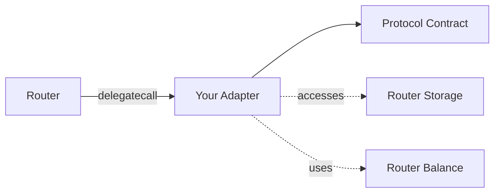

This guide walks you through building custom adapters to integrate new protocols with the Warp Router. You'll learn the requirements, best practices, and implementation patterns for creating production-ready adapters.

## Adapter Architecture

Adapters are protocol-specific contracts that handle settlement logic via delegatecall from the Router. They inherit the Router's storage context and permissions during execution.

**Key Principles from `AdapterBase.sol:8-61`:**
- Always executed via delegatecall from the Router
- Access Router's storage and balance during execution
- Must return function selector for validation
- Must implement ERC165 interface detection
- Only interact with trusted, audited protocols



## Implementation Requirements

Every adapter must meet these critical requirements:

### 1. Return Function Selector

All fill and claim functions must return their own selector:

```solidity
// From AdapterBase.sol:25
function myFillOperation(...) external returns (bytes4) {
    // Settlement logic here
    return this.myFillOperation.selector;
}
```

### 2. Implement ERC165

Support interface detection for all settlement functions:

```solidity
// From AdapterBase.sol:43-50
function supportsInterface(bytes4 interfaceId) public pure override returns (bool) {
    return interfaceId == this.myFillOperation.selector ||
           interfaceId == this.myClaimOperation.selector ||
           super.supportsInterface(interfaceId);
}
```

### 3. Use onlyViaRouter Modifier

Protect all external functions from direct calls:

```solidity
// From AdapterBase.sol:99-102
modifier onlyViaRouter() {
    _onlyRouterAdapter();
    _;
}

function myFillOperation(...) external onlyViaRouter returns (bytes4) {
    // Only callable via Router delegatecall
}
```

### 4. Security Constraints

**From `AdapterBase.sol:18-21`:**
- Never make direct calls to untrusted contracts
- Use only trusted, well-audited protocols
- Remember you're executing in Router's context
- Storage writes affect Router's storage

## Building Your First Adapter

Let's build a simple adapter for a custom DEX protocol:

<Steps>
  <Step title="Inherit from AdapterBase">
    Start with the base contract:

    ```solidity
    // SPDX-License-Identifier: BUSL-1.1
    pragma solidity ^0.8.28;

    import { AdapterBase, SemVer } from "../../base/adapter/AdapterBase.sol";

    contract MyDexAdapter is AdapterBase {
        // Your implementation
    }
    ```
  </Step>

  <Step title="Set up constructor">
    Initialize with Router and Arbiter addresses:

    ```solidity
    // From AdapterBase.sol:82-89
    constructor(
        address router,
        address arbiter  // Or address(0) for self-arbitration
    ) 
        AdapterBase(router, arbiter)
        SemVer(0, 0)  // Major version 0, minor version 0
    { }
    ```

    The constructor sets:
    - `_ROUTER`: Immutable router address for security checks
    - `ARBITER`: Contract that validates settlements (from `AdapterBase.sol:69`)
  </Step>

  <Step title="Define data structures">
    Create structs for your fill operations:

    ```solidity
    struct FillData {
        address tokenIn;
        address tokenOut;
        uint256 amountIn;
        uint256 minAmountOut;
        address recipient;
        bytes dexData;
    }
    ```
  </Step>

  <Step title="Implement fill function">
    Add your settlement logic:

    ```solidity
    function mydex_handleSwapFill(FillData calldata fillData)
        external
        payable
        onlyViaRouter
        returns (bytes4)
    {
        // 1. Extract solver context
        address solverRecipient = _extractSolverRecipient();
        
        // 2. Pre-fund user with output tokens
        _transferTokens(msg.sender, fillData.recipient, fillData.tokenOut, fillData.minAmountOut);
        
        // 3. Execute DEX swap
        uint256 amountOut = _executeSwap(fillData);
        
        // 4. Ensure slippage requirements met
        require(amountOut >= fillData.minAmountOut, "Slippage too high");
        
        // 5. Return selector for validation
        return this.mydex_handleSwapFill.selector;
    }
    ```
  </Step>

  <Step title="Extract solver context">
    Implement context extraction:

    ```solidity
    function _extractSolverRecipient() internal pure returns (address) {
        (uint256 contextLength, bytes calldata context) = _loadRelayerContext();
        require(contextLength == 20, InvalidRelayerContext());
        return address(bytes20(context[:20]));
    }
    ```

    The `_loadRelayerContext()` helper is provided by `AdapterBase.sol:137-144`.
  </Step>

  <Step title="Add interface detection">
    Implement ERC165 support:

    ```solidity
    function supportsInterface(bytes4 selector) 
        public 
        pure 
        override 
        returns (bool) 
    {
        return selector == this.mydex_handleSwapFill.selector ||
               super.supportsInterface(selector);
    }
    ```
  </Step>
</Steps>

## Advanced Patterns

### Using AdapterBasePrefund

For adapters that need to prefund recipients, inherit from `AdapterBasePrefund`:

```solidity
import { AdapterBasePrefund } from "../../base/adapter/AdapterBasePrefund.sol";

contract MyAdapter is AdapterBasePrefund {
    constructor(address router, address arbiter) 
        AdapterBasePrefund(router, arbiter) 
        SemVer(0, 0)
    { }
    
    function myFill(FillData calldata data) 
        external 
        payable 
        onlyViaRouter 
        returns (bytes4) 
    {
        // Prefund recipient with output tokens
        _prefundRecipient({
            from: msg.sender,
            to: data.recipient,
            tokenOut: data.tokenOut,
            amountOut: data.amountOut
        });
        
        // Then execute settlement
        _executeSettlement(data);
        
        return this.myFill.selector;
    }
}
```

**From `AdapterBasePrefund.sol:42-50`, the helper handles both native ETH and ERC20 tokens:**
```solidity
function _prefundRecipient(
    address from,
    address to,
    address tokenOut,
    uint256 amountOut
) internal {
    if (tokenOut == Constants.NATIVE_TOKEN) {
        to.safeTransferETH(amountOut);
    } else {
        tokenOut.safeTransferFrom(from, to, amountOut);
    }
}
```

### Multi-Token Support

For adapters handling multiple tokens (from `AdapterBasePrefund.sol:22-31`):

```solidity
function _prefundRecipient(
    address from,
    address to,
    uint256[2][] calldata tokenOut
) internal {
    uint256 length = tokenOut.length;
    for (uint256 i; i < length;) {
        _prefundRecipient(from, to, tokenOut[i][0].toAddress(), tokenOut[i][1]);
        unchecked { ++i; }
    }
}
```

### Custom Solver Context

Define complex context structures:

```solidity
struct MyRelayerContext {
    address tokenInRecipient;
    uint256 maxSlippageBps;
    address feeRecipient;
    uint256 feeBps;
}

function _loadMyContext() internal pure returns (MyRelayerContext memory) {
    (uint256 length, bytes calldata context) = _loadRelayerContext();
    
    // Validate length: 20 + 32 + 20 + 32 = 104 bytes
    require(length == 104, InvalidRelayerContext());
    
    return MyRelayerContext({
        tokenInRecipient: address(bytes20(context[0:20])),
        maxSlippageBps: uint256(bytes32(context[20:52])),
        feeRecipient: address(bytes20(context[52:72])),
        feeBps: uint256(bytes32(context[72:104]))
    });
}

// Provide encoding helper for solvers
function encodeRelayerContext(
    address tokenInRecipient,
    uint256 maxSlippageBps,
    address feeRecipient,
    uint256 feeBps
) external pure returns (bytes memory) {
    return abi.encodePacked(
        tokenInRecipient,
        maxSlippageBps,
        feeRecipient,
        feeBps
    );
}
```

### Skip Relayer Context

For adapters that don't need solver context (from `IntentExecutorAdapter.sol:227-229`):

```solidity
import { AdapterTagLib } from "@rhinestone/compact-utils/src/router/lib/v1/AdapterTagLib.sol";
import { Constants } from "@rhinestone/compact-utils/src/types/Constants.sol";

function ADAPTER_TAG() external pure override returns (bytes12) {
    return Constants.DEFAULT_ADAPTER_TAG.setSkipRelayerContext();
}
```

This tells the Router not to consume a context entry for this adapter in batch operations.

### Claim Operations

Implement claim functions for resource unlocking:

```solidity
function mydex_handleClaim(ClaimData calldata claimData)
    external
    payable
    onlyViaRouter
    returns (bytes4)
{
    // Extract solver context
    address recipient = _extractSolverRecipient();
    
    // Call protocol to unlock funds
    uint256 claimed = IMyProtocol(ARBITER).claimFunds(
        claimData.user,
        claimData.token,
        claimData.amount,
        recipient
    );
    
    // Validate claim succeeded
    require(claimed == claimData.amount, "Claim failed");
    
    return this.mydex_handleClaim.selector;
}
```

## Real-World Example: SameChainAdapter

Let's examine the production SameChainAdapter from `SameChainAdapter.sol`:

### Structure

```solidity
// From SameChainAdapter.sol:58
contract SameChainAdapter is AdapterBasePrefund, SameChainArbiter {
    
    // Data structure for Compact fills
    struct FillDataCompact {
        Types.Order order;
        Types.Signatures userSigs;
        bytes32[] otherElements;
        bytes allocatorData;
    }
    
    constructor(
        address router,
        address compact,
        address arbiter,
        address addressBook
    )
        AdapterBasePrefund(router, arbiter)
        SemVer(Version.SAMECHAIN_VERSION_MINOR, Version.SAMECHAIN_VERSION_PATCH)
        SameChainArbiter(router, compact, addressBook)
    { }
}
```

### Context Extraction

```solidity
// From SameChainAdapter.sol:115-120
function _tokenInRecipient() internal pure returns (address tokenInRecipient) {
    (uint256 relayerContextLength, bytes calldata relayerContext) = _loadRelayerContext();
    require(relayerContextLength == 20, InvalidRelayerContext());
    return address(bytes20(relayerContext[:20]));
}
```

### Fill Implementation

```solidity
// From SameChainAdapter.sol:172-177
function samechain_compact_handleFill(FillDataCompact calldata fillData) 
    external 
    payable 
    onlyViaRouter 
    returns (bytes4 selector) 
{
    _handleCompactFill(fillData, _tokenInRecipient());
    return this.samechain_compact_handleFill.selector;
}

// From SameChainAdapter.sol:233-247
function _handleCompactFill(
    FillDataCompact calldata fillData, 
    address tokenInRecipient
) internal {
    // 1. Pre-fund the recipient
    _prefundRecipient({ 
        from: msg.sender, 
        to: fillData.order.recipient, 
        tokenOut: fillData.order.tokenOut 
    });
    
    // 2. Call arbiter to process settlement
    (address sponsor, uint256 nonce) = SameChainArbiter(ARBITER)
        .handleCompact_NotarizedChain({
            order: fillData.order,
            sigs: fillData.userSigs,
            otherElements: fillData.otherElements,
            allocatorData: fillData.allocatorData,
            relayer: tokenInRecipient
        });

    // 3. Emit event
    emit RouterFilled(sponsor, nonce);
}
```

### Interface Support

```solidity
// From SameChainAdapter.sol:295-298
function supportsInterface(bytes4 selector) 
    public 
    pure 
    override(AdapterBase, ArbiterBase) 
    returns (bool supported) 
{
    return selector == this.samechain_compact_handleFill.selector ||
           selector == this.samechain_permit2_handleFill.selector ||
           AdapterBase.supportsInterface(selector) ||
           ArbiterBase.supportsInterface(selector);
}
```

## Testing Your Adapter

### Unit Tests

```solidity
contract MyAdapterTest is Test {
    MyAdapter adapter;
    Router router;
    
    function setUp() public {
        router = new Router(atomicSigner, adder, remover);
        adapter = new MyAdapter(address(router), arbiter);
    }
    
    function testFillOperation() public {
        // Prepare fill data
        FillData memory fillData = FillData({
            tokenIn: address(usdc),
            tokenOut: address(dai),
            amountIn: 1000e6,
            minAmountOut: 999e18,
            recipient: user,
            dexData: hex"..."
        });
        
        // Prepare solver context
        bytes memory context = abi.encodePacked(solverAddress);
        
        // Prepare calldata with context appended
        bytes memory adapterCalldata = abi.encodeWithSelector(
            adapter.mydex_handleSwapFill.selector,
            fillData
        );
        bytes memory fullCalldata = abi.encodePacked(
            adapterCalldata,
            context,
            uint256(context.length)
        );
        
        // Execute via delegatecall (simulating Router)
        vm.prank(solver);
        (bool success, bytes memory result) = address(adapter).delegatecall(fullCalldata);
        
        assertTrue(success);
        assertEq(bytes4(result), adapter.mydex_handleSwapFill.selector);
    }
    
    function testOnlyViaRouter() public {
        FillData memory fillData = /* ... */;
        
        // Direct call should fail
        vm.expectRevert(AdapterBase.OnlyDelegateCall.selector);
        adapter.mydex_handleSwapFill(fillData);
    }
    
    function testSupportsInterface() public {
        assertTrue(adapter.supportsInterface(
            adapter.mydex_handleSwapFill.selector
        ));
        assertTrue(adapter.supportsInterface(
            type(IAdapter).interfaceId
        ));
    }
}
```

### Integration Tests

```solidity
function testRouterIntegration() public {
    // Install adapter in router
    vm.prank(adder);
    router.installFillAdapter(
        0x0000,  // Version 0.0
        adapter.mydex_handleSwapFill.selector,
        address(adapter)
    );
    
    // Prepare fill
    bytes memory context = abi.encodePacked(solverAddress);
    bytes memory calldata = abi.encodeWithSelector(
        adapter.mydex_handleSwapFill.selector,
        fillData
    );
    
    // Execute through router
    vm.prank(solver);
    router.routeFill(context, calldata);
    
    // Verify results
    assertEq(token.balanceOf(user), expectedAmount);
}
```

## Deployment and Registration

See the [Deployment Guide](/integration/deployment) for details on deploying and registering your adapter with the Router.

## Best Practices

### Security

- **Validate inputs**: Always check addresses, amounts, and context data
- **Use SafeTransferLib**: Never use raw `transfer()` or `transferFrom()`
- **Trusted protocols only**: Only integrate with audited, production-ready protocols
- **Reentrancy protection**: Be aware of the Router's reentrancy guard

### Gas Optimization

- **Minimize storage**: Remember you're in Router's context - avoid unnecessary SSTORE operations
- **Use assembly carefully**: For calldata extraction, but maintain memory safety
- **Cache storage reads**: If reading Router storage, cache values
- **Efficient encoding**: Use `encodePacked` for solver context

### Maintainability

- **Clear documentation**: Document context format and requirements
- **Helper functions**: Provide encoding helpers for solvers
- **Versioning**: Use semantic versioning properly
- **Events**: Emit events for off-chain tracking

### Testing

- **Unit tests**: Test each function in isolation
- **Integration tests**: Test with actual Router
- **Fuzz testing**: Test with random inputs
- **Gas benchmarks**: Measure and optimize gas usage

## Next Steps

<CardGroup cols={2}>
  <Card title="Solver Context" icon="code" href="/integration/solver-context">
    Learn about solver context formats and patterns
  </Card>
  <Card title="Deployment" icon="rocket" href="/integration/deployment">
    Deploy and register your adapter
  </Card>
</CardGroup>