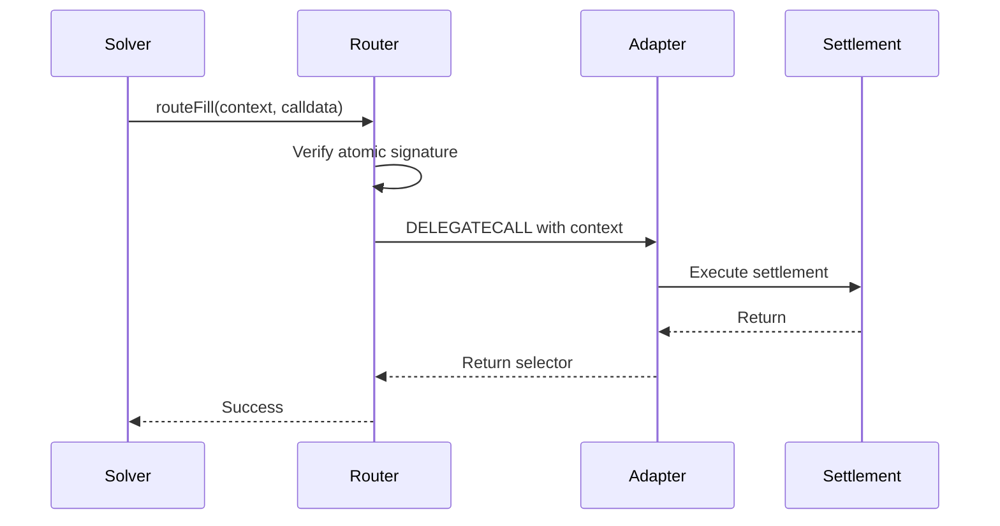

This guide walks you through integrating as a solver or relayer with the Warp Router system. You'll learn how to execute fill and claim operations, manage solver context, and optimize for gas efficiency.

## Overview

The Warp Router enables solvers to execute atomic operations across multiple protocols through a modular adapter system. As a solver, you'll interact with the Router contract to:

- Execute **fill operations** to fulfill user orders
- Process **claim operations** to unlock user resources
- Provide **solver context** to configure settlement behavior
- Optimize gas costs through batch operations

## Understanding the Router Architecture

The Router uses a delegatecall-based adapter pattern:



**Key Concepts:**
- The Router is located at `src/router/Router.sol:102`
- All adapter calls are executed via delegatecall in the Router's context
- Fill operations require atomic signatures for security
- Claim operations rely on protocol-level authorization

## Executing Fill Operations

Fill operations settle user orders by transferring assets. They require cryptographic signatures from the Router's atomic signer.

### Standard Fill Route

<Steps>
  <Step title="Prepare adapter calldata">
    Encode your fill operation with the appropriate adapter selector:

    ```solidity
    bytes memory adapterCalldata = abi.encodeWithSelector(
        ISameChainAdapter.samechain_compact_handleFill.selector,
        fillData
    );
    ```
  </Step>

  <Step title="Prepare solver context">
    Create your solver context based on the adapter's requirements. For SameChainAdapter:

    ```solidity
    // SameChainAdapter expects just the tokenIn recipient address
    address myRecipientAddress = 0x...; // Where you want input tokens sent
    bytes memory solverContext = abi.encodePacked(myRecipientAddress);
    ```

    See [Solver Context](/integration/solver-context) for details on context formats.
  </Step>

  <Step title="Execute the fill">
    Call the Router's `routeFill` function:

    ```solidity
    // For single fills (not optimized)
    router.routeFill(solverContext, adapterCalldata);
    ```

    Note: Single fills don't require atomic signatures. For production use, prefer the optimized batch route.
  </Step>
</Steps>

### Optimized Batch Fill

The `optimized_routeFill921336808` function provides 20-40% gas savings for batch operations through adapter caching and optimized encoding.

<Steps>
  <Step title="Prepare batch calldatas">
    Create an array of adapter calldatas:

    ```solidity
    bytes[] memory adapterCalldatas = new bytes[](3);
    
    adapterCalldatas[0] = abi.encodeWithSelector(
        ISameChainAdapter.samechain_compact_handleFill.selector,
        fillData1
    );
    
    adapterCalldatas[1] = abi.encodeWithSelector(
        ISameChainAdapter.samechain_compact_handleFill.selector,
        fillData2
    );
    
    adapterCalldatas[2] = abi.encodeWithSelector(
        ISameChainAdapter.samechain_compact_handleFill.selector,
        fillData3
    );
    ```
  </Step>

  <Step title="Prepare solver contexts">
    Create one context per regular adapter call:

    ```solidity
    bytes[] memory solverContexts = new bytes[](3);
    
    solverContexts[0] = abi.encodePacked(recipient1);
    solverContexts[1] = abi.encodePacked(recipient2);
    solverContexts[2] = abi.encodePacked(recipient3);
    ```

    <Note>
      Special selectors (singleCall, multiCall) don't consume solver contexts, so only include contexts for regular adapter calls.
    </Note>
  </Step>

  <Step title="Encode and sign">
    Encode the calldata array and obtain an atomic signature:

    ```solidity
    bytes memory encoded = abi.encode(adapterCalldatas);
    bytes32 hash = keccak256(encoded);
    
    // Get signature from the authorized atomic signer
    bytes memory atomicSig = getAtomicSignature(hash);
    ```
  </Step>

  <Step title="Execute optimized batch">
    Call the optimized route function:

    ```solidity
    router.optimized_routeFill921336808(
        solverContexts,
        encoded,
        atomicSig
    );
    ```
  </Step>
</Steps>

**Gas Optimization Features:**
- **Adapter Caching**: Consecutive calls with the same selector save ~2100 gas per reuse (from `RouterLogic.sol:250-257`)
- **Encoded Calldata**: Direct calldata access saves ~200-500 gas per element (from `RouterLogic.sol:160-162`)
- **Special Selectors**: Built-in operations bypass adapter lookup, saving ~2600+ gas (from `RouterLogic.sol:171-172`)

## Executing Claim Operations

Claim operations unlock user resources from protocols like TheCompact or Permit2. They don't require atomic signatures since authorization is handled at the protocol level.

### Single Claim

```solidity
// Prepare claim calldata
bytes memory claimCalldata = abi.encodeWithSelector(
    IAdapter.claimFunds.selector,
    claimParams
);

// Prepare solver context
bytes memory solverContext = abi.encode(solverData);

// Execute claim
router.routeClaim(solverContext, claimCalldata);
```

### Batch Claims

Process multiple claims atomically:

```solidity
bytes[] memory claimCalldatas = new bytes[](claimCount);
bytes[] memory solverContexts = new bytes[](claimCount);

// Prepare each claim
for (uint i = 0; i < claimCount; i++) {
    claimCalldatas[i] = abi.encodeWithSelector(
        IAdapter.claimFunds.selector,
        claimParams[i]
    );
    solverContexts[i] = abi.encode(solverData[i]);
}

// Execute batch
router.routeClaim(solverContexts, claimCalldatas);
```

From `RouterLogic.sol:331`, batch claims use the same caching optimizations as fills.

## Special Selectors

The Router supports special selectors that bypass adapter lookup for maximum efficiency:

- **`singleCall`**: Direct contract interaction
- **`multiCall`**: Batched contract interactions
- **Fee collection operations**

These save ~2600+ gas by avoiding SLOAD and DELEGATECALL overhead (from README.md:352).

```solidity
// Example: Using multiCall in a batch
bytes[] memory calldatas = new bytes[](2);

// Regular adapter call (consumes solver context)
calldatas[0] = abi.encodeWithSelector(
    ISameChainAdapter.samechain_compact_handleFill.selector,
    fillData
);

// Special selector (doesn't consume solver context)
calldatas[1] = abi.encodeWithSelector(
    IMultiCallAdapter.multicall_handlePayable.selector,
    value,
    executions
);

// Only one solver context needed
bytes[] memory contexts = new bytes[](1);
contexts[0] = abi.encodePacked(recipient);
```

## Error Handling

### Common Errors

**`InvalidAtomicity`** (from `RouterLogic.sol:201`)
- The atomic signature is invalid or from an unauthorized signer
- Ensure your signature is from the Router's configured `$atomicFillSigner`

**`LengthMismatch`** (from `RouterLogic.sol:292`)
- Solver contexts don't match the number of regular adapter calls
- Remember: special selectors don't consume contexts

**`AdapterCallFailed`** (from `RouterLogic.sol:272`)
- The adapter call reverted or returned wrong selector
- Check that your calldata is properly formatted
- Verify adapter requirements are met

**`AtomicSignerNotSet`** (from `RouterLogic.sol:150`)
- The Router's atomic signer is set to address(0)
- The Router is paused for fill operations

## Best Practices

### Gas Optimization

1. **Batch Similar Operations**: Group operations using the same adapter to leverage caching (saves ~2100 gas per cache hit)
2. **Use Optimized Routes**: Always use `optimized_routeFill921336808` for production batches
3. **Minimize Context Size**: Keep solver context data as compact as possible to reduce calldata costs
4. **Leverage Special Selectors**: Use built-in operations when possible

### Security

1. **Signature Management**: Protect the atomic signer's private key - it controls all fill operations
2. **Context Validation**: Ensure solver context matches adapter expectations
3. **Batch Atomicity**: Remember that all operations in a batch succeed or revert together
4. **Gas Limits**: Account for gas stipends in pre-claim operations

### Integration Testing

```solidity
// Example test pattern
function testFillOperation() public {
    // 1. Prepare fill data
    FillData memory fillData = FillData({
        order: order,
        userSigs: sigs,
        otherElements: new bytes32[](0),
        allocatorData: allocatorData
    });
    
    // 2. Encode calldata
    bytes memory adapterCalldata = abi.encodeWithSelector(
        ISameChainAdapter.samechain_compact_handleFill.selector,
        fillData
    );
    
    // 3. Prepare context
    bytes memory context = abi.encodePacked(solverAddress);
    
    // 4. Execute
    vm.prank(solver);
    router.routeFill(context, adapterCalldata);
    
    // 5. Verify state changes
    assertEq(token.balanceOf(recipient), expectedAmount);
}
```

## Next Steps

<CardGroup cols={2}>
  <Card title="Solver Context" icon="code" href="/integration/solver-context">
    Learn about solver context formats for different adapters
  </Card>
  <Card title="Building Adapters" icon="puzzle-piece" href="/integration/building-adapters">
    Create custom adapters for new protocols
  </Card>
  <Card title="Deployment" icon="rocket" href="/integration/deployment">
    Deploy and configure the Router system
  </Card>
</CardGroup>